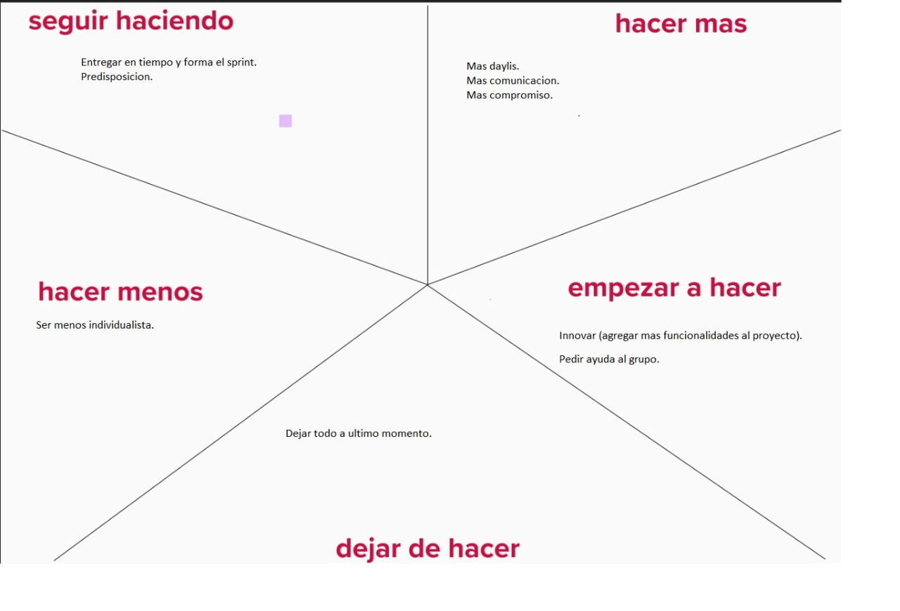

# Retrospectiva SPRINT 1

En el sprint 1 nos encargamos de diseñar el wireframe de nuestro diseño, nos sentimos cómodos en el equipo y estábamos muy entusiasmados para trabajar en equipo. durante el sprint cada decisión que tomamos fueron consensuadas en las reuniones de meets.
en cuanto a los aspectos a reforzar decidimos que necesitamos más encuentros para ponernos de acuerdo en algunos temas que se necesitan solución en equipo.
en cuanto a las cosas positivas, pudimnos resolver el sprint en tiempo y forma, no tuvimos complicaciones con los tiempos de entrega.
en cuanto a las cosas positivas, pudimos resolver el sprint en tiempo y forma, no tuvimos complicaciones con los tiempos de entrega.